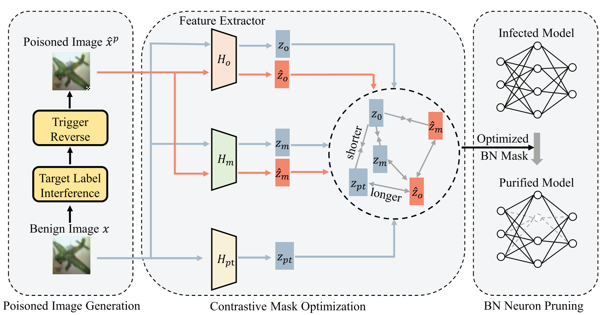

# Contrastive Neuron Pruning for Backdoor Defense
## Method
Recent studies have revealed that deep neural networks (DNNs) are susceptible to backdoor attacks, in which attackers insert a pre-defined backdoor into a DNN model by poisoning a few training samples. A small subset of neurons in DNN is responsible for activating this backdoor and pruning these backdoor-associated neurons has been shown to mitigate the impact of such attacks. Current neuron pruning techniques often face challenges in accurately identifying these critical neurons, and they typically depend on the availability of labeled clean data, which is not always feasible. To address these challenges, we propose a novel defense strategy called Contrastive Neuron Pruning (CNP). This approach is based on the observation that poisoned samples tend to cluster together and are distinguishable from benign samples in the feature space of a backdoored model. Given a backdoored model, we initially apply a reversed trigger to benign samples, generating multiple positive (benign-benign) and negative (benign-poisoned) feature pairs from the backdoored model. We then employ contrastive learning on these pairs to improve the separation between benign and poisoned features. Subsequently, we identify and prune neurons in the Batch Normalization layers that show significant response differences to the generated pairs. By removing these backdoor-associated neurons, CNP effectively defends against backdoor attacks while requiring the pruning of only about 1% of the total neurons. Comprehensive experiments conducted on various benchmarks validate the efficacy of CNP, demonstrating its robustness and effectiveness in mitigating backdoor attacks compared to existing methods.

## Requirements

* Install required python packages:

```
  conda create -y -n CNP python=3.8
  conda activate CNP
  pip install -r requirements.txt
```
## Dataset Preparation
Download the CIFAR-10 dataset and place it in the `./data/cifar` folder. 

## Backdoored Model Training

The data poisoning part (the folder `./core`) in our paper is based on [BackdoorBox](https://github.com/THUYimingLi/BackdoorBox/blob/main/). You can follow the instructions in BackdoorBox to generate backdoored models.

This demo uses the BadNet backdoor attack on CIFAR-10 as an example. You can find the pre-trained backdoored model in [google drive](https://drive.google.com/drive/folders/1Lx7qjfoPglWhE3PNUGE1ziH80CS6WaJ3?usp=sharing) `./poisoned_model/poisoned_cifar10_badnet/ckpt_epoch_200_BA0.9071_ASR1.0.pth`.

## Optimize Mask Value with CNP


> CUDA_DEVICES=0 python optimize_mask_CL.py  --test_model './poisoned_model/poisoned_cifar10_badnet/ckpt_epoch_200_BA0.9071_ASR1.0.pth' --output_dir ./save/badnet_model --attack_method badnet

* test_model: The backdoored model.

* output_dir: The output folder for the optimized mask value.

* -attack_method: The backdoored method.


## Prune the Backdoor Neurons

> CUDA_DEVICES=0 python prune_neuron_cifar.py  --test_model './poisoned_model/poisoned_cifar10_badnet/BackdoorBch_200_BA0.9071_ASR1.0.pth' --output_dir ./save/badnet_model --attack_method badnet

* test_model: The backdoored model.

* output_dir: The output dir for the optimized mask value.

* -attack_method: The backdoored method.

## Citation
```
@ARTICLE{10887056,
  author={Feng, Yu and Ma, Benteng and Liu, Dongnan and Zhang, Yanning and Cai, Weidong and Xia, Yong},
  journal={IEEE Transactions on Image Processing}, 
  title={Contrastive Neuron Pruning for Backdoor Defense}, 
  year={2025},
  volume={34},
  number={},
  pages={1234-1245},
  keywords={Neurons;Training;Data models;Feature extraction;Robustness;Perturbation methods;Face recognition;Electronic mail;Computational modeling;Batch normalization;Backdoor defense;image classification;contrastive learning},
  doi={10.1109/TIP.2025.3539466}}
```

## Acknowledgements
This project is based on [ANP](https://github.com/csdongxian/ANP_backdoor/tree/main) and [BackdoorBox](https://github.com/THUYimingLi/BackdoorBox/blob/main/). Thanks for their wonderful works.
